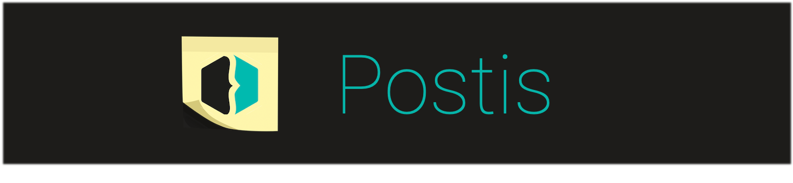
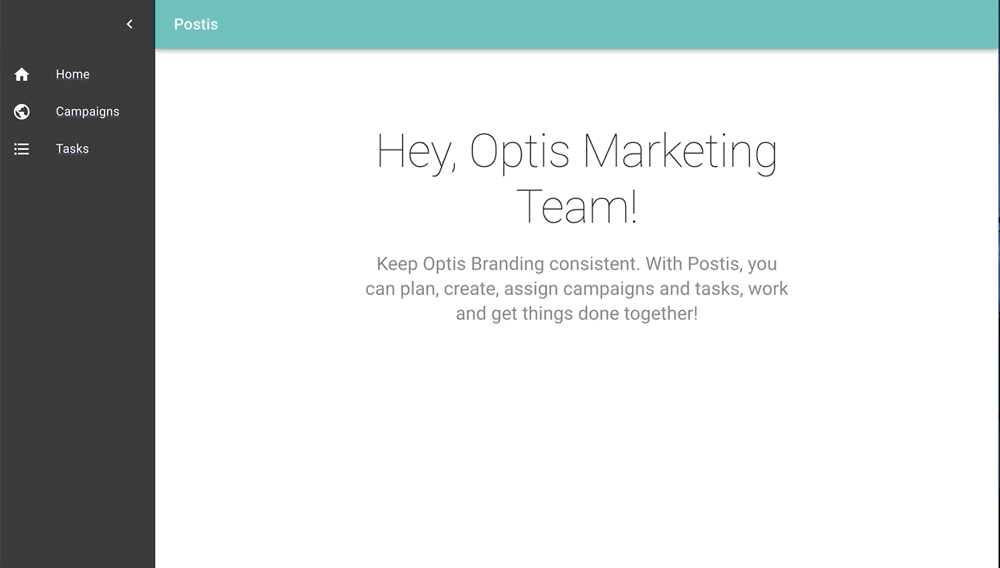

# Postis 
At Optis we have a ‘marketing’ team that makes sure that the Optis Branding is consistent, relevant and attractive in its industry. As all companies we therefore use social media channels. In order to plan the content we post on these, we want to create a webapplication that all team members can use and work together on. The application will consist of 3 pages:

## Tasks

This page should consist of a list of all tasks we want to accomplish and be reminded about. E.g. If we have a team meeting next week, we want to create a reminder task, so we don’t forget to create a tweet about this. A task should also be able to be marked as DONE. 

## Campaigns

A campaign can be around a long term or short term focus point for Optis. We should be able to group a set of tasks as part of a campaign. E.g. Create a React Campaign, so we regularly post something about React, so the world knows we do a lot of react development. 

## Dashboard

The dashboard should show the latest activity. E.g. Kjell created a task “Make picture of Mathi’s talk” 10 minutes ago. 

## Technologies
For this project the following technologies were used:
- HTML, CSS, Material-UI and React for front-end
- NodeJs for back-end
- PostgreSQL-Knex for database

## Installation

To install and run the project, follow these steps:

1. Clone the Git project off of GitHub:

`git clone git@github.com/ZHanimK/postis/`

2. Browse to the project folder in your terminal

`cd postis`

3. Browse client folder in project root in your terminal for install frontend

`cd client`

4. install dependencies and start

`npm install`
`npm start`

5. Browse server folder in project root in your terminal for install backend

`cd server`
`npm install`

6. install demo-data (migrations and seeds)

`npm run migrate-dev`
`npm run seed-dev`

7. start server 

`npm start`

